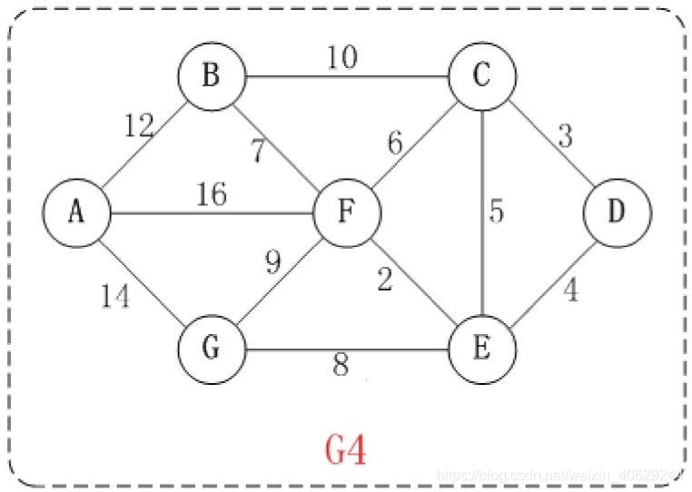

# 图路径搜索算法

------

## 迪杰斯特拉(Dijkstra)算法

迪杰斯特拉(Dijkstra)算法是典型最短路径算法，用于计算一个节点到其他节点的最短路径，  
它的主要特点是以起始点为中心向外层层扩展(广度优先搜索思想)，直到扩展到终点为止。

参考：  

[数据结构与算法－求最短路径之迪杰斯特拉（Dijkstra）算法](https://cloud.tencent.com/developer/article/1753132?from=article.detail.1421128)

------

### 算法步骤

1. 初始时，引进两个集合S和U，S只包含起点s，U包含除s外的其他顶点，且U中顶点的距离为起点s到该顶点的距离；

2. 从U中选出距离最短的顶点k，并将顶点k加入到S中，同时，将从U中移除顶点k；

3. 更新U中各个顶点到起点s的距离。之所以更新U中顶点的距离，是由于上一步中确定了k是求出最短路径的顶点，  
从而可以利用k来更新其它顶点的距离。

4. 重复步骤2和3，直到遍历完所有顶点。

------

### 算法实例

以图G4为例，以D为起点对该算法进行演示。

以下是实现步骤:

------

